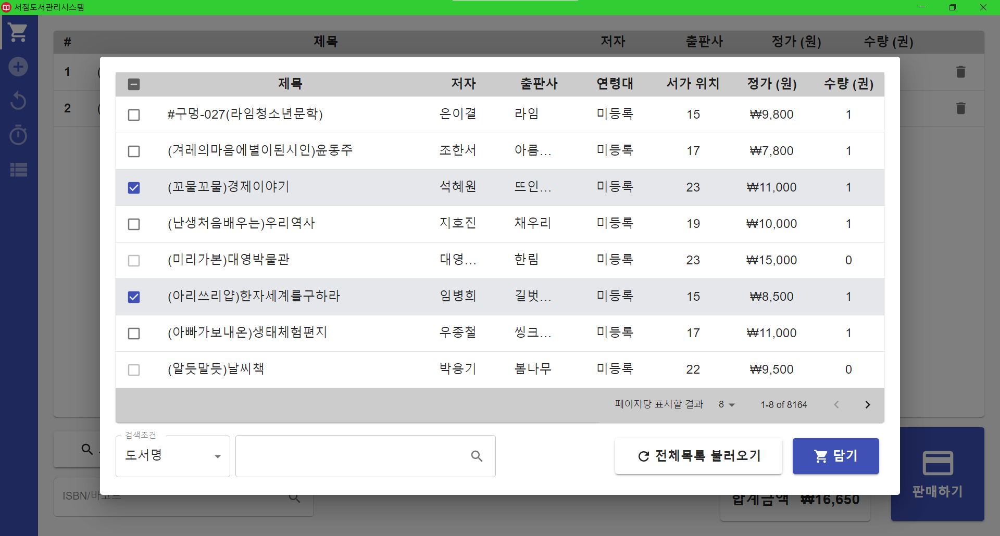

# 서점도서관리시스템

❓ Problem : 아버지께서 운영하는 서점에는 낡은 도서관리 POS 프로그램이 있습니다. 어느 윈도우 개발자가 만들어 유료로 배포하던 시스템인데요. 회원관리, 도서입출고 기록 관리, 재고관리, 영수증 계산 등 복잡하고 다양한 기능들이 있지만 10년동안 아버지가 쓰던 기능은 그리 많지 않습니다. 반면에 유료로 라이선스를 구매했음에도 불구하고 컴퓨터가 고장나거나 사정상 새로운 PC에 프로그램을 설치하려면 매번 개발자에게 연락해 추가비용을 지불하고 설치를 받아야 했습니다. 그 가격이 만만치 않아 아버지께 도움을 드릴 방법이 없을까 고민해보았습니다. 😮

‼ Idea : 아버지가 주로 사용하는 기능만 추려 직접 개발해드리면 좋지 않을까? 🤔

💯 Solution : 도서관리시스템을 React어플리케이션으로 작성해 ElectronJS로 데스크톱 어플리케이션으로 포팅해보자! 😁

## 서점도서관리시스템 실사용 스크린샷

PostgreSQL서버를 웹에 띄운 뒤 .env파일로 연결해 빌드하면 데스크톱 어플리케이션을 직접 실행해볼 수 있습니다.

  
  
  
  
  
  

## 주요기능

- **판매하기**: 재고로 등록되어 있는 도서 중 판매할 책을 불러와 가격 및 재고를 정산해주는 기능입니다. 도서 전체 할인율을 일괄적용할 수 있습니다. 재고 상 찾을 수 없는 도서라면 `입고하기` 화면으로 넘어가 입고처리를 도와줍니다.
- **입고하기**: 재고판매 전 서점에 있는 도서를 등록하는 기능입니다. 기존 DB에 존재하는 책이라면 수량의 변경만, 없는 도서라면 신간등록을 할 수 있습니다. 매입처를 설정해 `입출고기록`을 남깁니다.
- **반품하기**: 재고 중 특정 매입처로 반품처리 할 수 있는 기능입니다. 재고 상에서 수량이 변경되며 `입출고기록`이 남습니다.
- **입출고기록**: 판매/입고/반품된 기록을 날짜별/종류별로 모아볼 수 있으며 해당 내역을 Excel파일로 저장하는 기능입니다.
- **재고관리**: 현재 시스템에 등록된 모든 도서를 검색/수정/삭제 등이 가능한 Admin기능입니다. 수량, 도서정보 등을 변경할 수 있습니다.
- **바코드 스캔**: 한국에 유통되는 모든 도서 뒷면에 찍힌 바코드는 ISBN과 일치합니다. `판매하기`, `입고하기`, `반품하기` 화면 도서검색 입력창에 autofocus를 넣어두어 바코드 스캐너로 책을 바로 읽을 수 있게 설계했습니다.
- **공공도서검색 API 활용**: 신규 도서등록시 기본 책정보를 웹 API를 활용해 가져올 수 있습니다.

## 프로젝트 개발 기간

- 기획 및 MVP 개발: 2021.01.24 ~ 2022.02.11

## 기술 스택

- Front: TypeScript, React, Material UI, Webpack
- Backend: PostgreSQL

## 프로젝트 회고

- 같은 문제를 해결하기 위해 2020년 상반기에 PyQT, SQLite로 프로그램을 구현했었습니다. 이후 웹개발 공부를 하고 싶어 UI/UX를 리디자인하고 데이터베이스를 웹상(ElephantSQL)으로 옮기는 등 재개발한 프로젝트입니다.
- 첫 React프로젝트여서 코드의 관심사 분리와 프로젝트 구조, 상태관리등이 미숙했습니다. Redux 대신 React에 내장되어 있는 `useReducer`로 전역상태를 관리하려고 했다는 점이나 충분히 모듈화되지 않아 코드 라인이 어마어마하게 길어지는 등 미숙한 점이 보입니다.
- 그럼에도 짧은 시간동안 필요한 기능을 충실하게 구현해냈습니다. 입대 1주일 전에 제작한 어플리케이션이라 추후 유지보수를 제대로 해드리지 못했지만 군복무를 마치는 최근까지도 큰 불편함 없이 잘 사용하셨다고 말씀해주셨습니다. MVP를 잘 추려 사용자에게 최단시간에 전달한 첫 서비스가 아닐까 싶습니다.
- 밥 먹고 자는 시간을 제외하면 모든 시간을 쏟아부을만큼 몰입해서 작업했습니다. 아버지와 면담하면서 기능요구사항을 추려내고 그에 맞는 화면을 공책에 그려가며 화면 디자인을 완성하고, React 공식 문서, Material UI 공식 문서, Stack Overflow 등을 열심히 뒤져가며 어떻게든 기능을 구현하려 애썼습니다. 시간에 쫓기다 보니 컴포넌트의 재사용성을 제대로 챙기기보다 만들어진 기존화면을 Ctrl-C, Ctrl-V하는 경우가 많았는데 추후 리팩토링을 하면 더 좋지 않았을까 싶습니다. 아버지가 서점에서 실제로 어플리케이션을 사용하는 모습을 보았을 때의 뿌듯함은 지금도 생생합니다.
- 작은 동네 서점들은 아직도 종이 장부로 책을 관리하는 경우가 많다고 합니다. 이런 프로그램을 구매할 여력이 없거나, 필요성을 잘 못 느껴서겠지요. 비록 아버지께서 이제는 서점을 정리하고 다른 일을 준비하고 계시기에 어플리케이션을 더 발전시키지 않지만 이런 소스가 다른 작은 서점들에도 무료로 사용될 수 있으면 좋겠습니다. 물론 그러려면 다듬을 부분이 많겠지만요. 😁
